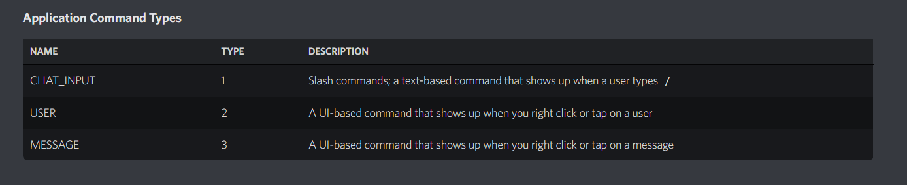
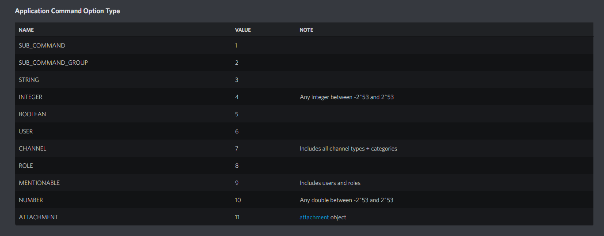
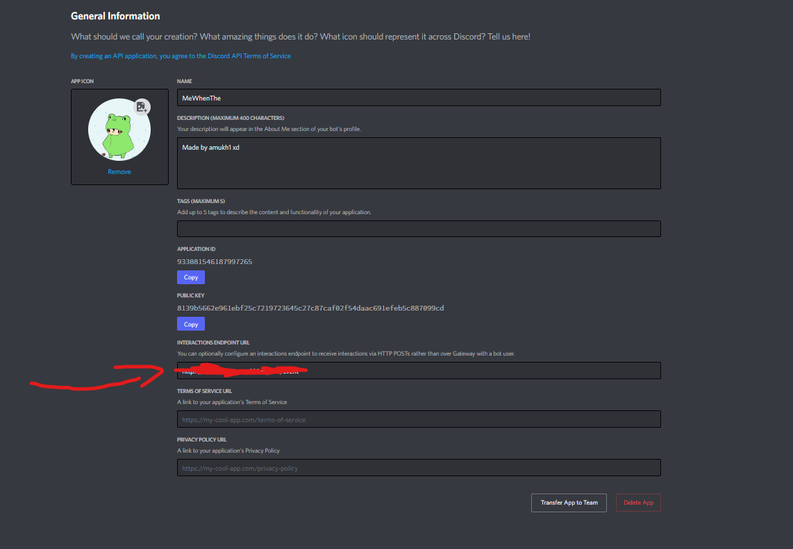

[](https://www.npmjs.com/package/discord-easy-slash)

# discord-easy-slash

> A small library for making slash commands easy without using gateways or discord.js. Just the *raw* Discord Api.

## Prerequisites

This project requires NodeJS (version 8 or later) and NPM.
[Node](http://nodejs.org/) and [NPM](https://npmjs.org/) are really easy to install.
To make sure you have them available on your machine,
try running the following command.

```sh
$ npm -v && node -v
6.4.1
v8.16.0
```

## Getting Started

These instructions will get you a copy of the project up and running on your local machine for development and testing purposes. See deployment for notes on how to deploy the project on a live system.

## Installation
<br>

**BEFORE YOU INSTALL:** please read the [prerequisites](#prerequisites)

<br>

To install and set up the library, run:

```sh
$ npm install discord-easy-slash
```

Or if you prefer using Yarn:

```sh
$ yarn add --dev discord-easy-slash
```

## Usage

### First, Start by importing the library

```js
var client = require('discord-easy-slash');
```

### Then, Provide all of your bot's details

```js
client.PUBLIC_KEY = '<PUBLIC_KEY>'
client.TOKEN = '<TOKEN>'
client.APP_ID = '<APPLICATION_ID>'
client.GUILD_ID = 'GUILD_ID' // (you still need this, as you have to have a testing server)
```

### Making a command:

```js
client.command('help', 1, 'help command?', null)
```

The *command* function takes 4 arguments, *Name* (Of the command), *Type* (Of the command), *Description* (Of the command), and *Options*, any options that the command takes.

### For types:

or look at this [page](https://discord.com/developers/docs/interactions/application-commands#application-command-object-application-command-types) by discord.

### For options:
They look like this:
```js
[ { "name": "nameofoption", "description": "descriptionofoption", "type": 4, "required": true, } ]
```
It takes an array, with all the options for the command. Because of this, you can have multiple options for a single command.

For types of objects:

or look at this [page](https://discord.com/developers/docs/interactions/application-commands#application-command-object-application-command-option-type) by discord.

### Main Event Listener:

```js
client.on('slash_event', (command, data, res, type) => {
  console.log('slash event!')
})
```

#### The event listener only has 1 event to listen for as of 1.0.7: 'slash_event'(s).
<br>

slash_event takes 4 arguments, *command*, *data*, *res*, and *type*.
<br>

*command* is the name of the slash command that was sent.
<br>

*data* is the data that was sent with the command.
<br>

*res* is the response object that you can use to send a message back to the user.
<br>

and *type* is the type of the command.


```js
client.on('slash_event', (command, data, res, type) => {
if(command == 'help'){
    client.reply(res, 'Help command?', null)
    }else {
        client.reply(res, 'Cound not find command..', null)
    }
});
```
client.reply takes 3 arguments, *res*, which is mandatory because it is used to send the message, *message*, which is the message to send, and *embeds*, which is an array of embeds for the command to send.

### For embeds:

```js
[ { "title": "title", "description": "description", "color": "color", "fields": [ { "name": "name", "value": "value", "inline": true }, { "name": "name", "value": "value", "inline": true } ] } ]
```

### Making our bot search for interactions/logging-in/turning it on:

```js
client.listen(80)
```

## Telling Discord where to look for our bot:
Inside the **INTERACTION ENDPOINTS URL** box, put in the url of the server your bot is running on, with the endpoint "/event".
<br>
For example:
`https://server_address/event`


or
<br>
discord.com/developers/applications/<APP_ID>/information

### Serving the app

```sh
$ npm start
```

## Contributing

You can contribute to the project by making a pull request on [GitHub](https://github.com).

## Credits

# Amukh1.

## Built With

* [Node](https://nodejs.org/)
* [Express + Cors](https://expressjs.com)
* [Discord](https://discord.com/developers/docs/intro)
* [Love](https://amukh1.dev)

## Authors

* **Amukh1** - [Github](https://github.com/amukh1)

See also the list of [contributors](https://github.com/your/project/contributors) who participated in this project.

## License

[MIT License](https://andreasonny.mit-license.org/2019) © Amukh1